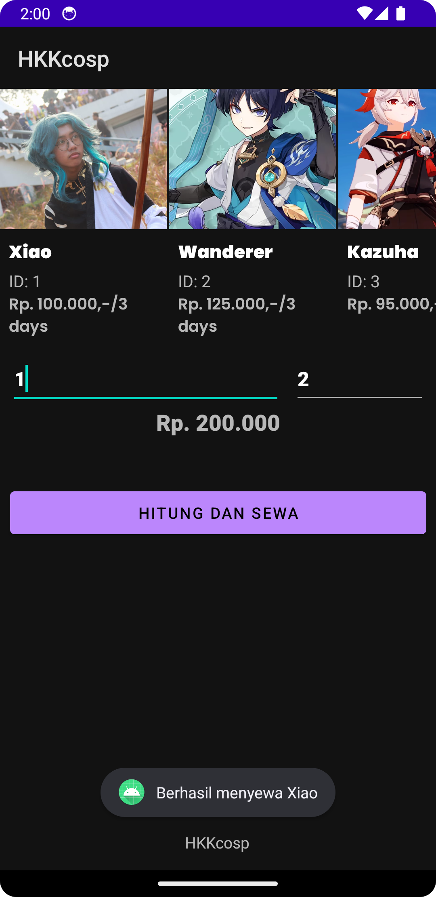

# HKKcosp - Cosplay Renting App

Hkkcosp is a cosplay renting app developed by a team of talented individuals:

- Hafidz Muhammad Rizky
- Ginting Kimi Endri
- Muhammad Khalifi Nawwaffarel Indratno

## About Hkkcosp

Hkkcosp allows users to rent anime costumes for their cosplay needs. Whether you're attending a convention, hosting a themed party, or just want to channel your inner anime character, Hkkcosp has got you covered.

## Screenshots
### Dark Mode

### Light Mode

## Cost Estimation

With Hkkcosp, you can easily find out how much it will cost you to rent your desired anime costume. Our app provides transparent pricing information, ensuring that you can plan your cosplay budget with ease.

## License
This project is open source and is licensed under the MIT License. Feel free to use, modify, and distribute it as per the terms of the MIT License.

